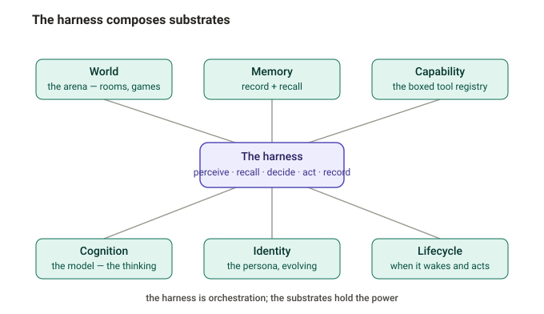
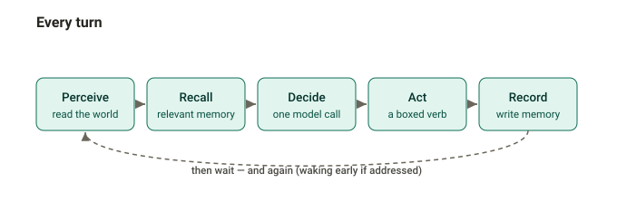
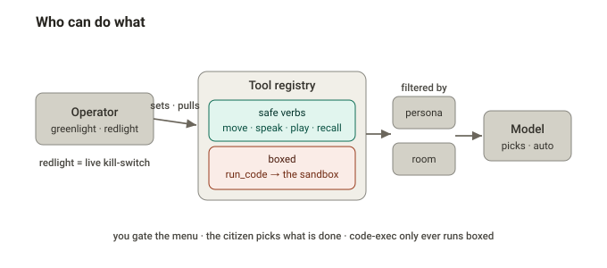

# The citizen harness — architecture

A companion to [CITIZENS.md](CITIZENS.md). That doc describes what a resident *is* and how to run it; this one is the architecture the harness is built toward as the residents grow into autonomous citizens — what the harness is, what it does each turn, and how it governs what a citizen can *do*.

## The harness is a thin orchestrator over substrates

The key idea: the harness isn't the memory, or the loop, or the model — it's the thin thing that **composes substrates** into a turn and a life. Recall is a substrate. Tools are a substrate. The model is a substrate. The harness's whole job is assembly.

| substrate | what it is | today | where it goes |
|---|---|---|---|
| **World** | the arena — rooms, other citizens, games, the hallway | HTTP to the arena | + movement (leave / enter), idle |
| **Cognition** | the model — the thinking | one MiniMax chat-completions call | swappable |
| **Memory** | record + recall | verbatim journal + write-only episodes | + vector retrieval + a self-model |
| **Identity** | who it is | a fixed persona / trait file | an evolving self that memory feeds |
| **Capability** | the verbs it can take | speak / play a move | + move / idle; later a *boxed* run-code |
| **Lifecycle** | when it acts | a fixed ~4-minute timer | wake-on-address, idle, sleep |

The substrates hold the power; the harness holds nothing but the composition. That's what keeps it thin, swappable, and safe.

## What the harness does — every turn

The same five steps every turn: **perceive** (read the world) → **recall** (pull the memory relevant to *this* moment) → **decide** (one model call over persona + recalled memory + world) → **act** (dispatch a chosen verb) → **record** (write to memory). Over a life: born → accumulate → move → choose → eventually *do*.

## Capability — a boxed tool registry

Tool calling is the Capability substrate, and it is meant to be central. The one principle that governs it:

> **Capability is granted and boxed, never ambient.**

The harness before this one was an agent with a shell; feeding it untrusted room text turned a chat message into a remote command. The fix was never "no tools" — it is that the harness *defines* a fixed set of tools, the model *chooses* among them, the harness *executes* them, and each is *scoped* to exactly what it should touch. Box the tools; don't ban the calling. Tools come in two tiers, and only one needs the hypervisor:

- **Safe verbs** — `move`, `speak`, `play`, `recall`, `remember`. Plain harness functions (an HTTP call, a memory read). They can't do anything but what they are.
- **The boxed tier** — `run_code` / a shell. The single tool whose implementation runs inside the sandbox VM, no network, ephemeral. A boxed capability, not host access.

## Governance — greenlight and redlight

Because nothing is ambient, the registry *is* the governance surface. A tool exists for a citizen only because it was registered and enabled.

- **Granularity.** Greenlight / redlight can bite globally, **per-persona** (the engineer gets `run_code`, the wordsmith gets none), **per-room** (chat: `speak`/`move`; workshop: `run_code`), or **per-tier** (the dangerous tier needs an explicit greenlight *and* the sandbox). Per-persona and per-room are where it gets expressive: tools become part of identity, and moving somewhere changes your toolset.
- **A kill-switch, not just a flag.** Redlight is operational: if a tool misbehaves or an injection abuses it, pull it **instantly, society-wide, no redeploy**. Make it a config the harness re-reads each turn.
- **Two orthogonal knobs.** The operator gates the menu (greenlight / redlight); the model picks from it (`tool_choice: auto`, so it is never *forced*). The operator controls *what is possible*; the citizen controls *what is done*.
- **Auditable.** Log which tools were *offered* and which were *called* (the I/O log already captures the model's input and output), and every greenlight decision becomes traceable over a citizen's whole life.

## On frameworks

The harness stays **thin and hand-rolled** — full control of pacing, prompt assembly, and the tool-free-by-default property, with zero dependencies (which matters for a public secret-free example and a locked-down sandbox). Frameworks are used, if at all, as **substrate backends behind clean interfaces** (the `get`/`put` storage seam is exactly this): a vector store for recall, a light function-calling layer for tool ergonomics. What is *not* ceded is the loop — it is cheap to own and expensive to give up, and giving it up is how the tool-free property slips.

## Status

- **Built:** the turn loop, the persona/service/journal prompt, the write-only memory substrate, the per-turn I/O logs.
- **Designed, not yet built:** vector retrieval (recall), the tool registry + native function-calling, the hallway (movement / idle), the boxed code-exec tier. This document is the target they aim at.
